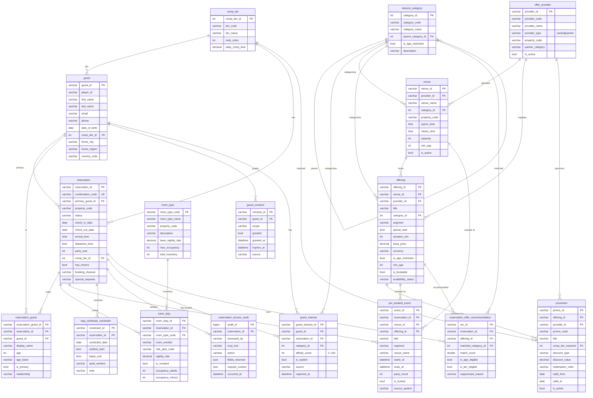

# Casino Itinerary — ER Diagram (`casino_demo`, v3)

Entity-relationship diagram for the live Aiven **`casino_demo`** database — the full-parity
MySQL port of the BigQuery `casino_demo` reference (`06_casino_demo_schema.sql` +
`07_casino_demo_seed.sql`). 16 tables, enforced FKs. Grouped by MCP owner.

## Notes
- **MCP ownership:**
  - **MCP-A Reservation Context + Lodging** → `comp_tier`, `guest`, `reservation`,
    `reservation_guest`, `room_type`, `room_stay`, `pre_booked_event`,
    `stay_schedule_constraint`, `guest_consent`, `reservation_access_audit`.
  - **MCP-B Entertainment Interests** → `interest_category`, `guest_interest`.
  - **MCP-C Casino & Partner Offers** → `offer_provider`, `venue`, `offering`, `promotion`,
    `reservation_offer_recommendation`.
- **Booking path:** there is no generic "offering_reservations" table — `reserveOffering`
  writes a **`pre_booked_event`** row on the reservation, so newly booked items feed
  `getScheduleConstraints` conflict detection automatically.
- **Age gating** is taxonomy-driven (`interest_category.is_age_restricted`) plus per-row
  `offering.min_age` / `venue.min_age`; suppression outcomes persist in
  `reservation_offer_recommendation.suppressed_reason`.
- **PII** is governed by `guest_consent` (scope `pii:contact`), not a request header.
- IDs are STRING (`GST-000x`, `RES-000x`, `OFR-000x`, `PRV-*`, `VEN-000x`); `comp_tier_id`
  and `category_id` are INT. `PK`/`FK`/`UK` = primary/foreign/unique key.
