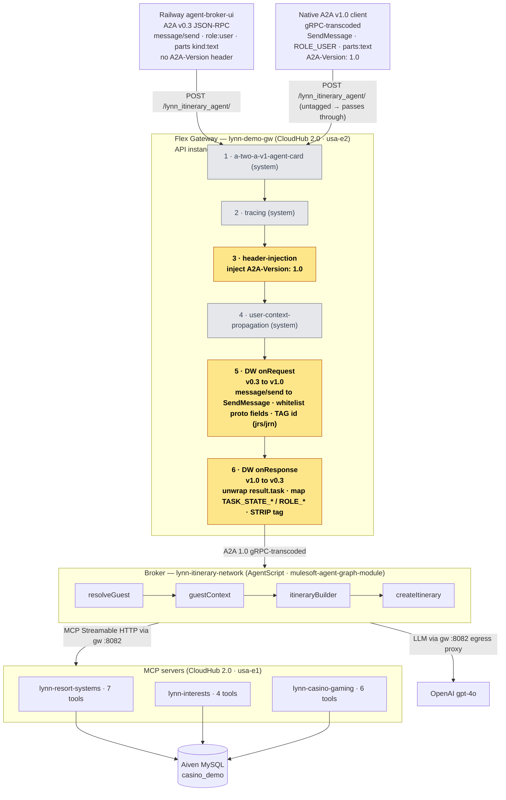

# Lynn Itinerary Agent — Architecture (A2A transport bridge)

**Legend** — amber = the three A2A-bridge policies we added/modified (header-injection + the two
DataWeave body transforms); grey = pre-existing system policies created by the broker registration.
Policies 5 & 6 form the bidirectional translator; native gRPC traffic (untagged `id`) passes through
both untouched, so one URL serves both A2A generations.
